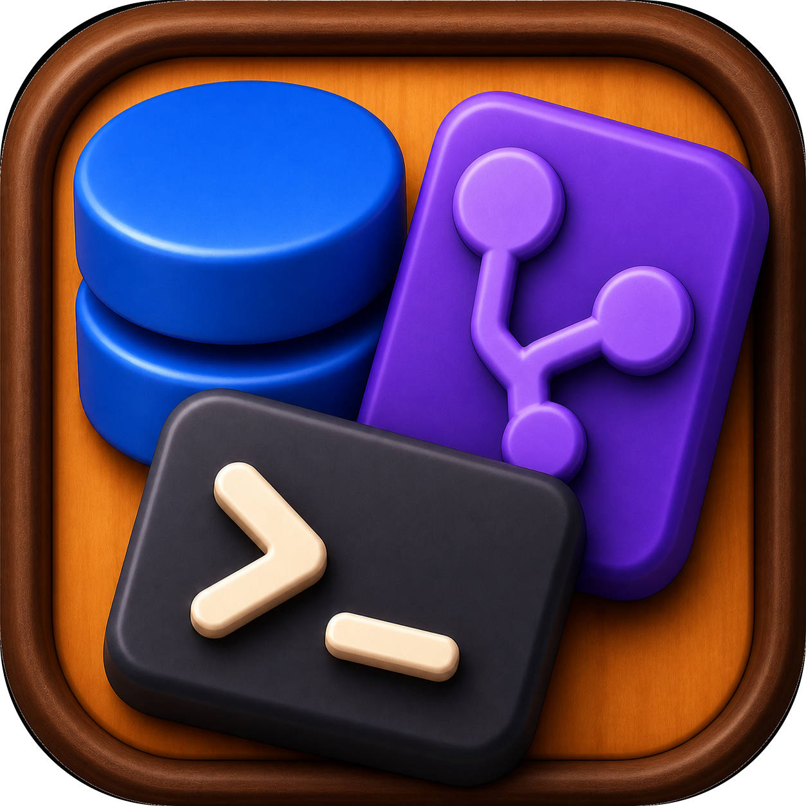
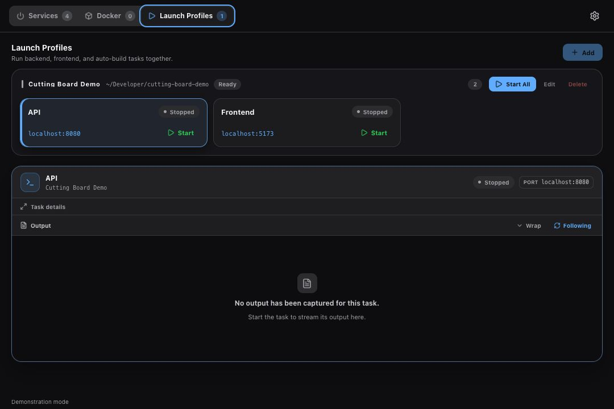

<p align="center">
  
</p>

<h1 align="center">Cutting Board</h1>

<p align="center">A native desktop control board for local development services.</p>

<p align="center">
  Discover what is running, see it by project, and start or stop your own development tasks from one place.
</p>

<p align="center">
  
</p>

## Overview

Cutting Board is a local-first desktop app for keeping track of development services on your machine. It discovers TCP listeners owned by the current user, groups them by project, identifies common runtimes and frameworks, shows Docker containers, and provides saved launch profiles for project commands.

The app is built with [Tauri 2](https://v2.tauri.app/), a TypeScript/Vite frontend, and a Rust native core. It has no account, cloud sync, telemetry, or login-startup behavior.

## Highlights

### Services

- Refreshes local TCP listeners on a configurable interval.
- Groups services by project and infers project roots from common markers such as `.git`, `package.json`, `Cargo.toml`, `pyproject.toml`, `go.mod`, Maven/Gradle files, and Compose files.
- Identifies common web frameworks, API runtimes, databases, caches, and proxies.
- Shows ports, status, uptime, memory, process origin, browser links, and process details.
- Keeps operating-system noise, desktop apps, build daemons, and unrelated-user processes out of the workspace view where they can be safely identified.

### Docker

- Reads `docker ps -a` when the Docker CLI is available.
- Shows container state, image, status, published ports, and Compose project/service metadata.
- Falls back to read-only container listener information when Docker cannot be queried.

### Launch Profiles

- Save a project root and multiple named shell tasks—for example, backend, frontend, and watch commands.
- Start and stop tasks individually or together, with an optional expected port for each task.
- Track the process session Cutting Board started, inspect live output, and keep task logs locally.
- Detects a task's expected port when another process is already using it; externally owned processes are never stopped by the profile manager.

<p align="center">
  
</p>

## Safety and privacy

Cutting Board only exposes listeners classified as belonging to the current user. Before stopping a discovered service, the native core revalidates its PID, process creation time, and available ownership metadata, and refuses to target PID 1 or Cutting Board itself. It sends `SIGTERM` first and uses `SIGKILL` only after the validated process does not exit gracefully.

Process command lines can contain secrets. The scanner redacts common password, token, secret, authorization, credential, API-key, and URL-userinfo values before returning process details to the UI. Launch commands are intentionally user-authored shell commands, so review a profile before starting it; its logs remain local and may contain output from the launched program.

Demonstration mode disables actions that change processes or profiles.

## Prerequisites

- macOS or Linux for local service discovery (`lsof` is used first; Linux can fall back to `ss`).
- Node.js 20.19 or newer. Node.js 22.12 or newer is recommended.
- Rust 1.77.2 or newer with the stable toolchain.
- The platform dependencies listed in the [Tauri 2 prerequisites](https://v2.tauri.app/start/prerequisites/). Linux builds need WebKitGTK 4.1 development packages and the related system libraries.
- Docker CLI is optional and is only needed for full Docker metadata; the Docker tab remains available in read-only fallback mode without it.

## Quick start

```bash
npm install
npm run tauri dev
```

The Vite development server uses `http://localhost:1420` when running the frontend directly. `npm run tauri dev` starts the native desktop app and rebuilds generated runtime icons as needed.

## Demonstration mode

Use deterministic sample services, containers, and a launch profile without changing real processes:

```bash
npm run tauri dev -- -- --demo
```

The packaged binary accepts the same native options:

```text
cutting-board --demo
cutting-board --auto-close-seconds 5
cutting-board --help
cutting-board --version
```

## Development commands

| Command | Purpose |
| --- | --- |
| `npm run check` | Type-check the frontend. |
| `npm run build` | Type-check and build the Vite frontend. |
| `npm run icons` | Regenerate runtime and application icons. |
| `cargo fmt --manifest-path src-tauri/Cargo.toml --all -- --check` | Check Rust formatting. |
| `cargo test --manifest-path src-tauri/Cargo.toml --all-targets` | Run the Rust test suite. |
| `npm run tauri build` | Build the Tauri application bundle. |

Equivalent Make targets are available for the common workflow:

```bash
make install
make dev
make check
make test
make build
```

Rust tests are embedded in `#[cfg(test)]` modules under `src-tauri/src/`; there is no separate tracked test directory.

## Local data

Cutting Board resolves its application data directory through Tauri's `app_config_dir`. It stores:

- `settings.json` — theme, scan interval, and saved window geometry.
- `launch-profiles.json` — local launch profiles and their tasks.
- `logs/` — output captured from managed launch tasks.

These files stay on the device and are not synchronized to a service.

## Repository layout

```text
assets/                         Icon source and current interface screenshots
public/icons/                   Generated UI and technology icon assets
scripts/build-icons.mjs         Rebuilds generated icon assets
src/                            TypeScript frontend and Tauri API client
src-tauri/src/                  Rust scanner, Docker integration, storage, and launch manager
src-tauri/capabilities/         Tauri capability declarations
package.json                    Frontend scripts and dependencies
Makefile                        Common development commands
```

## License

MIT. See [LICENSE](LICENSE).
