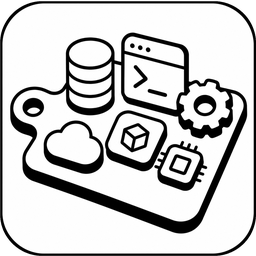
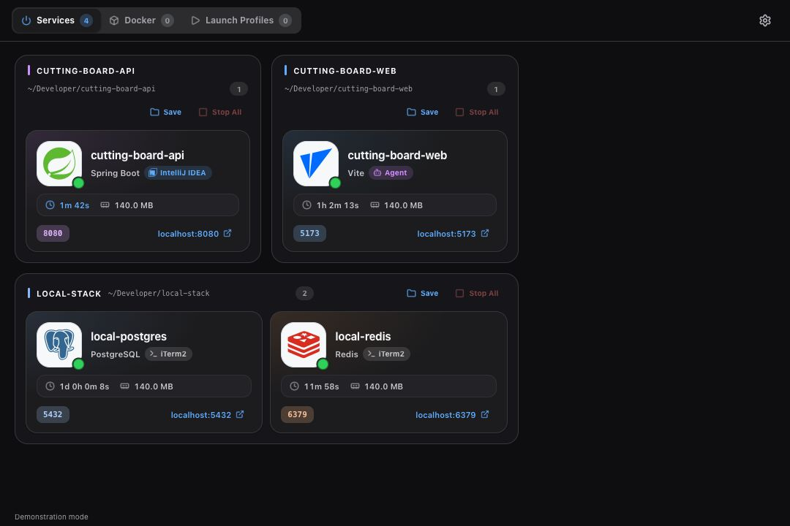

<p align="center">
  
</p>

<h1 align="center">Cutting Board</h1>

<p align="center">
  A local development services board for Linux and macOS, independent of any IDE.
</p>

Cutting Board watches the TCP listeners on your machine, works out which of them
are development services and which are noise, and draws the survivors as tiles
grouped by project. Nothing has to register with it: start a dev server from a
terminal, an agent or an IDE and it appears on the next scan. Optionally, register
the commands that make up a project in the Korean **실행 구성** tab and start or
stop them together without opening an IDE. The scanner and managed commands share
the window's lifetime — there is no daemon and no autostart.



The application's user interface is in Korean. This documentation is in English.

## Why

Running several coding agents in parallel leaves invisible processes behind:
a Vite server here, a Spring Boot app there, a Postgres container, a stray
Storybook. `ss -tlnp` tells you a port is taken; it does not tell you which
project it belongs to or whether you still need it. Cutting Board answers those
two questions at a glance and lets you stop the process without hunting for the
terminal that started it. A launch profile also replaces the common IDE Services
workflow: one project can start its backend, source watcher and frontend together,
show their output, and stop the process groups Cutting Board created.

## Install on macOS

Homebrew is required. From the checkout, install the Tk-enabled Python runtime
and create the project environment, then open the board:

```bash
./scripts/install-macos.sh
./scripts/run.sh
```

Verify the runtime, test suite, live scanner and native Tk window with:

```bash
./scripts/verify-macos.sh
```

The current `.app`/ZIP build and personal Homebrew Cask skeleton are documented
in [packaging/macos/README.md](packaging/macos/README.md). Those local artifacts
are unsigned and not notarized.

## Install on Ubuntu

Build the Debian package from the checkout and install it:

```bash
sudo apt install dpkg-dev
./scripts/build-deb.sh
sudo apt install ./dist/cutting-board_0.1.0_all.deb
cutting-board
```

`./scripts/install-ubuntu.sh` does the same in one step, building the package
first if it is not there yet. The package is a build output and is not kept in
the repository; the `ubuntu-24.04` workflow also uploads one as a build
artifact.

`apt install ./...deb` pulls in the declared dependencies (`python3`,
`python3-tk`, `python3-psutil`). Uninstall with `sudo apt remove cutting-board`.

## Run from source on Ubuntu

```bash
sudo apt install python3 python3-tk python3-psutil

./scripts/run.sh            # the real board
./scripts/run.sh --demo     # deterministic demonstration data
./scripts/dev.py            # the same, restarted whenever a source file changes
```

`dev.py` watches `src/` and `assets/` and restarts the process about a second
after a save, passing its own arguments through (`./scripts/dev.py --demo`). It
is not hot reloading: Tk keeps live widgets bound to the classes they were built
from, so reloading a module in place would leave half the window running old
code. Restarting is the honest version, and the window reopens where it was
because the application saves its geometry when it is asked to stop. A syntax
error does not end the session — the watcher reports the exit code and waits for
the next save.

`--demo` is entirely self-contained: it renders a fixed snapshot, its stop
buttons never signal a real PID, and its Docker tab is fed by `demo_containers()`
rather than the Docker daemon. It is safe on a machine with no Docker installed
and is what the GUI smoke test drives.

Python 3.10 or newer, plus `psutil`. Only `psutil` is a third-party runtime
dependency; Tkinter ships with the distribution's Python.

## Command line

```
cutting-board                        open the board
cutting-board --demo                 open the board with demonstration data
cutting-board --version              print name and version
cutting-board --scan-interval 4      override the saved scan interval (0.75-30 s)

cutting-board --snapshot             scan once, print a table, do not open the GUI
cutting-board --snapshot --json      the same scan as machine-readable JSON
cutting-board --snapshot --containers  also list container plumbing
cutting-board --snapshot --all       list every TCP listener, noise included
```

`--json`, `--containers` and `--all` only mean anything alongside `--snapshot`.
The plain-text snapshot prints one row per service with the project, service
name, technology, PID, ports and redacted command. The JSON form contains the
same set of services with plain strings and JSON primitives, never enum objects,
and never the raw `command` token array.

Exit codes: `0` success, `1` the scan produced warnings, `2` the platform is not
supported, `3` Tkinter is missing, `4` no display could be opened.

## What reaches the board, and what does not

Most listening sockets on a desktop are not development work. Every listener is
classified once, in `src/cutting_board/scanner/relevance.py`, into one of three
buckets:

| Bucket | Meaning | Shown |
|---|---|---|
| `dev` | A recognised framework, daemon or tool, or an unrecognised process running out of a real project checkout | **서비스** tab |
| `container` | Docker, Podman or Kubernetes plumbing — `docker-proxy`, `dockerd`, `containerd`, `k3s`, and friends | Docker tab, and `--snapshot --containers` |
| `noise` | Everything else | Never |

The rules, in order:

1. A listener owned by another UID is noise. Cutting Board only ever shows and
   signals processes belonging to the user running it.
2. Container runtimes and proxies are `container`.
3. Known desktop applications are noise even when started from inside a
   repository — ulauncher, github-desktop, jetbrains-toolbox, browsers, chat
   clients, sync agents and the rest of the list in `relevance.py`.
4. Build-tool daemons are noise. A Gradle daemon, a Gradle worker, the Kotlin
   compile daemon, the Maven daemon and Nailgun all open a TCP port for their
   own client protocol and then sit there for hours after the build finished;
   none of them is a service anybody visits. They are matched on their main
   class or launcher jar, never on the word "gradle" — the application that
   `./gradlew bootRun` forks is exactly what the board is for.
5. If the classifier recognised an actual framework or daemon, it is `dev`.
6. An unrecognised executable living under a distribution prefix (`/usr/lib`,
   `/usr/libexec`, `/usr/sbin`, `/opt`, `/snap`, the flatpak and snapd state
   directories) is a system daemon, so it is noise.
7. Anything left is `dev` if it runs out of a detected project, and noise if it
   does not.

There is no "include system services" switch and no search box: the point of
the board is that it is short enough not to need either. `--snapshot --all`
prints the unfiltered list when you need to check what was dropped.

## The board

Cards are grouped into sections by project and sorted within a section by lowest
port. Each compact horizontal card carries the brand mark, service name, up to
two port chips, uptime and visible Korean actions. Uptime under five minutes is
tinted with the accent colour, so a just-restarted service stands out. A card
also carries a badge when the board can tell which tool launched the service —
see below. Larger text, higher-contrast secondary copy and visible focus states
keep the board readable and keyboard-operable on both supported platforms.

Everything else the scanner knows — endpoints and their scope, PID and PPID,
user, CPU, resident memory, working directory, executable, the redacted command
line and any warnings — lives in the detail dialog, one click away.

- **Click a card** or its **상세** action to open the detail dialog.
- **Ctrl-click** a card whose service looks like a web endpoint to open it in
  the default browser; the visible **열기** action does the same.
- **중지** on a service you own asks for confirmation and then stops it.
- Tab focuses cards and controls; arrow keys move between a focused card's
  actions, and Enter or Space activates the selected action.
- Service, container and settings dialogs close on Escape, on the close button,
  or on a click outside them.
- **설정** in the header opens settings: the version, the Python and platform
  it is running on, where the settings file lives, the scan interval, and the
  **시스템 설정**/**다크**/**라이트** screen mode. The version deliberately
  appears nowhere else — not in the title bar, not in the footer.

The grid reflows to the window width. The window remembers its geometry in the
settings file. Existing and invalid settings retain the compatible dark default.
Choosing a screen mode saves and reapplies the complete palette immediately
without stopping scans or managed tasks. **시스템 설정** follows the macOS global
appearance when best-effort detection succeeds and otherwise falls back to dark.

The board holds still. A scan lands every two seconds, but a render only redraws
when something a tile actually paints has changed; otherwise the existing tiles
are left alone and only the uptime line is refreshed in place. Without that the
whole board would be destroyed and rebuilt twice a minute, which reads as a
flicker and loses your scroll position every time.

## Launch configurations

The **실행 구성** tab stores optional launch profiles separately from listener
discovery. A profile has a name and an absolute project root. Each task has:

- a task name;
- a working directory inside the project, either relative to the root or an
  absolute path;
- the command to run;
- an optional expected TCP port, used to recognise an already-running external
  service; and
- an optional auto-build/watch command that runs alongside the main command.

Profiles and tasks can be started or stopped as a group or individually. Cutting
Board starts each main and watcher command in its own process group and captures a
bounded, in-memory combined output stream. Logs disappear when the application
closes; they are never written to disk.

Commands run through a selected login-capable shell with `shell=False`: macOS
prefers its executable `/bin/zsh`; other platforms use the current account's safe
login shell, falling back to `/bin/sh`. Linux therefore has no zsh dependency.

For example, a `dutypark` profile can replace the two IntelliJ Services entries:

| Task | Working directory | Command | Expected port | Auto-build/watch |
|---|---|---|---:|---|
| Backend | `.` | `./gradlew bootRun --args=--spring.profiles.active=dev` | 8080 | `./gradlew classes --continuous` |
| Frontend | `frontend` | `npm run dev` | 5173 | — |

Vite provides its own source watching and hot-module replacement. On the backend,
the continuous Gradle `classes` task recompiles changed Java/Kotlin sources and
resources; Spring Boot DevTools then restarts the application context. Changes to
build logic or dependencies still require stopping and starting the backend task.
If the required JDK or Node executable is not on a GUI application's `PATH`, put
its absolute path or a `JAVA_HOME=...` prefix in the saved command.

Expected-port matching is deliberately conservative. A listener already running
from the same project is shown as **외부 실행 중**. It was not started by Cutting
Board, so neither a task stop nor a profile stop signals it. Conversely, closing
Cutting Board warns that processes started by Cutting Board will be stopped; if
confirmed, all of their verified process groups are terminated before the window
closes. Signal-driven and automated shutdown skip the dialog but perform the same
cleanup.

## Who started it

When an agent or an editor started a service, the card says so with a small
badge in its metadata row — violet for a coding agent, cyan for an IDE.
Claude, Codex, Cursor, Windsurf, Copilot, Aider, Gemini, VS Code and JetBrains
are recognised. A service you started yourself in a terminal gets no badge:
that is the ordinary case, and labelling it would put a badge on everything.

Two signals answer the question. The first walks the process tree upwards
looking for a launcher it knows. The second reads the environment the process
inherited and looks for marker variables such as `CLAUDECODE` or
`CODEX_SESSION_ID` — only their names, never their values.

The second signal is what makes a detached server attributable. A Gradle daemon
or a backgrounded dev server reparents to init the moment it daemonises, so its
ancestry says nothing more than "the system started it", while the environment
it inherited still names the agent that did.

`ANTHROPIC_*` and `OPENAI_*` are deliberately ignored, because a globally
exported API key would otherwise badge every service on the board.

## Docker tab

Docker is a tab of its own, not a filter. It shells out to the Docker CLI:

```
docker ps --all --no-trunc --format '{{json .}}'
```

Containers are grouped by their `com.docker.compose.project` label, with
standalone containers last and running containers first inside each group. The
brand mark comes from the image name, so `postgres:16-alpine` gets the
PostgreSQL mark. Published host ports are read from the left of each `->` entry,
with the dual-stack duplicate collapsed away; a port that is merely exposed by
the image is not shown, because nothing on the host can reach it.

The call never raises and never blocks for more than two seconds. When Docker is
missing, stopped, or the socket is not readable, the tab says so in that many
words and falls back to listing the container-owned listeners the port scanner
found on its own. The container list refreshes every 6 seconds while the tab is
open and every 45 seconds while it is not, because a `docker ps` is far more
expensive than a port sweep.

## Project detection

The working directory of a listening process is walked upwards. A `.git` root
wins; failing that, the nearest directory holding a supported marker is used.
The nearest `package.json` is remembered separately, so a service in a monorepo
can still be named after its own package.

Supported markers: `.git`, `pnpm-workspace.yaml`, `package.json`, `pom.xml`,
`build.gradle{,.kts}`, `settings.gradle{,.kts}`, `Cargo.toml`, `pyproject.toml`,
`go.mod`, `docker-compose.y{a,}ml`, `compose.y{a,}ml`.

`/`, `/tmp`, `/var/tmp`, `/usr`, `/opt`, `/etc` and `$HOME` are never project
roots. A dotfiles repository in the home directory is common enough that without
this rule every application started from `~` would be filed under a project
named after the user.

Services with no detected project are grouped under a catch-all section rather
than being hidden.

## Stopping a service

The stop action sends `SIGTERM` to the PID that actually owns the port and waits
1.5 seconds. If the process is still alive, a second confirmation offers
`SIGKILL`. Before either signal is sent, the terminator re-checks that:

- the PID is not 1, not Cutting Board itself, and greater than 1;
- the process creation time still matches the one recorded during the scan, so a
  recycled PID cannot be signalled by mistake;
- the effective UID still matches the current user.

This action stops only the discovered listening process. Managed launch tasks use
their separate owned process-group lifecycle; they can be restarted and expose
their bounded output in **실행 구성**.

## Assets

The board draws brand marks, tile chrome and power glyphs from PNGs committed
under `assets/`. They are produced by a build-time script that the application
itself never runs:

```bash
./scripts/build-assets.py      # brand marks, tiles, glyphs, window icon blob
./scripts/build-app-icon.py    # application icon sizes from the master artwork
```

`build-assets.py` needs network access, Pillow, pycairo and PyGObject with
librsvg; `build-app-icon.py` needs only Pillow. Neither is a runtime dependency.
`build-assets.py` downloads 59 Simple Icons marks, rasterises each with librsvg,
tints it for legibility on the near-black canvas, draws two further glyphs
locally (`service` and `ssh`, which have no brand to borrow), renders the three
tile states and the two power glyphs, and packs the application icon into the
`_NET_WM_ICON` payload described below. Output lands in `assets/icons/` (61
marks at 48 px and 96 px), `assets/ui/` and `assets/window-icon.argb`. Run it
only when the catalogue changes.

Brand marks are from [Simple Icons](https://github.com/simple-icons/simple-icons),
released under [CC0 1.0](https://creativecommons.org/publicdomain/zero/1.0/).
Each mark remains the trademark of the project it represents and is used here
only to identify that technology.

## Window icon

Tk 8.6 sets only the legacy WM_HINTS icon pixmap on X11, which modern desktops
ignore, so `src/cutting_board/ui/window_icon.py` writes the `_NET_WM_ICON`
property itself through ctypes and Xlib once the window manager has reparented
the window. The whole path is best effort — no X11, no library or no artwork
simply leaves the window as Tk left it. GNOME does not draw application icons in
title bars, so the visible effect is in the task switcher and the dock.

## Project layout

```text
src/cutting_board/
├─ app.py               CLI parsing, platform check, GUI assembly
├─ controller.py        the scan thread and its latest-event queue
├─ constants.py         name, version, interval bounds, markers, secret flags
├─ launch_models.py     immutable launch-profile and runtime snapshots
├─ launch_controller.py persisted profiles plus managed-process coordination
├─ models.py            immutable snapshot dataclasses
├─ presentation.py      visibility rules, grouping, display formatting
├─ demo.py              deterministic data for --demo and smoke tests
├─ scanner/
│  ├─ base.py           the ServiceScanner protocol
│  ├─ linux.py          TCP listeners plus process metadata
│  ├─ macos.py          macOS TCP listeners from /usr/sbin/lsof
│  ├─ classifier.py     what a process or an image is running
│  ├─ relevance.py      dev / container / noise
│  ├─ origin.py         which tool launched a process
│  ├─ macos_origin.py   macOS process readers for origin detection
│  └─ docker.py         the docker ps wrapper
├─ services/
│  ├─ termination.py    validated SIGTERM and SIGKILL
│  ├─ launch_profiles.py atomic mode-0600 launch-profile JSON
│  ├─ managed_processes.py owned process groups and bounded in-memory logs
│  ├─ settings.py       atomic XDG JSON settings
│  └─ browser.py        opening a local URL
└─ ui/
   ├─ main_window.py    tabs, board rendering, event pump
   ├─ launch_widgets.py launch-profile and task cards
   ├─ launch_dialogs.py launch-profile editor and log viewer
   ├─ widgets.py        scroll area, section headers, tiles
   ├─ dialogs.py        detail and confirmation dialogs
   ├─ theme.py          palette, metrics, fonts
   ├─ icons.py          PNG loading and caching
   └─ window_icon.py    _NET_WM_ICON via ctypes/Xlib

assets/                 committed artwork; assets/icons is generated
scripts/                run, watch-and-restart, verify, package, asset builds
packaging/              Debian files and the macOS app/Cask skeleton
tests/                  unit tests and a live TCP integration test
SPEC.md                 the detailed specification
CONTRIBUTING.md         development setup and conventions
CHANGELOG.md            release notes
TEST_REPORT.md          the last recorded verification run
AGENTS.md               working rules for coding agents on this repository
```

## Tests

```bash
PYTHONPATH=src python3 -m unittest discover -s tests
./scripts/verify.sh          # the full gate: compile, tests, snapshot, GUI, package
```

`verify.sh` needs `dpkg-dev`, plus either `xvfb-run` or a display it can already
reach for the GUI stages; with neither it stops there rather than reporting a
pass it did not earn. The same script runs on an `ubuntu-24.04` GitHub Actions
runner.

## Privacy and permissions

- No network requests, no telemetry, no accounts, no cloud storage.
- Run it as your normal user; `sudo` is neither required nor recommended.
- `${XDG_CONFIG_HOME:-~/.config}/cutting-board/settings.json` holds window
  geometry, the scan interval and the screen-mode preference. Optional launch
  profiles, including their
  commands, are written atomically to
  `${XDG_CONFIG_HOME:-~/.config}/cutting-board/launch_profiles.json` with mode
  `0600`.
- Snapshots and bounded managed-process logs exist in memory only. No process,
  port, log or termination history is persisted.
- Common secrets on a command line (`--token`, `--api-key`, `--password`,
  `KEY=VALUE` pairs whose key mentions a token, password, secret, api-key,
  credential, auth or database URL) are masked before the command is displayed
  or exported.
- Processes owned by other users are never signalled and never shown.
- Launcher attribution reads process ancestry and environment marker names from
  `/proc` on Linux and through psutil on macOS. No environment value is kept,
  shown or exported.
- Launch profiles contain exactly the commands and paths the user enters. Cutting
  Board does not copy the current process environment or secret values into the
  profile file. Saved commands are not redacted, so do not enter credentials in
  them.

## Limitations

- Linux and macOS are supported. Other operating systems exit before scanning.
- macOS listener discovery depends on the system `/usr/sbin/lsof` command.
- TCP `LISTEN` sockets only. UDP services and portless workers are invisible.
- The host network namespace only. A port that exists solely inside a container
  network is not visible to the port scanner; the Docker tab covers published
  ports instead.
- Launch configurations capture bounded output and start or stop their own tasks;
  discovered external services still have no log capture or restart control.
- There are no health checks. An expected port indicates external activity, not
  application health.
- **시스템 설정** resolves the macOS appearance when the palette is applied; it
  does not watch for a later OS appearance change while the window remains open.
- Names and projects are inferred from live process state, so an unusual launcher
  may land in the catch-all group.
- Stopping a discovered service signals the listening process, not its process
  tree. Stopping a managed launch task terminates only the process groups Cutting
  Board created for that task.

## Licence

MIT — see [LICENSE](LICENSE). Brand marks under `assets/icons/` are from Simple
Icons under CC0 1.0, as described above.
