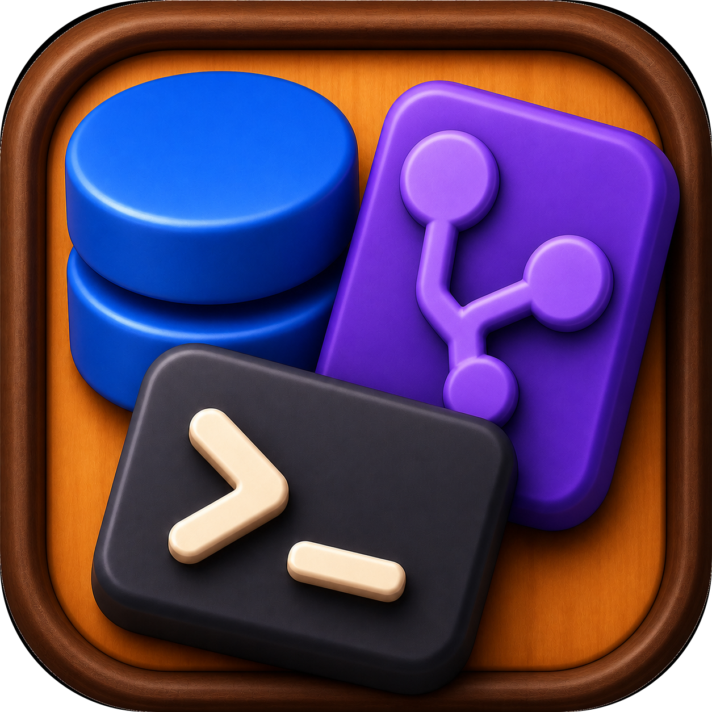
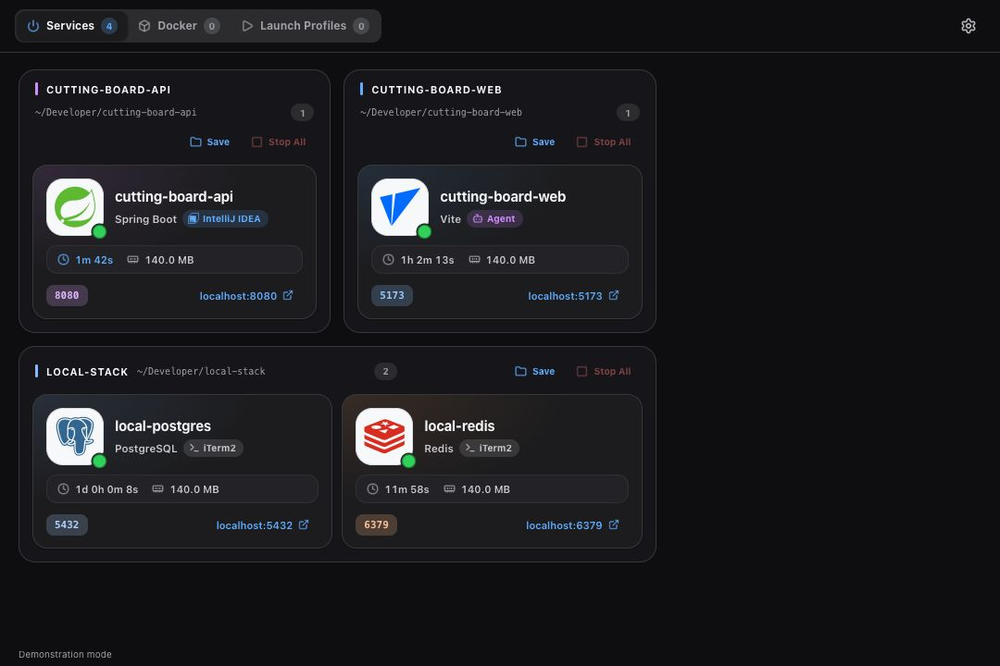
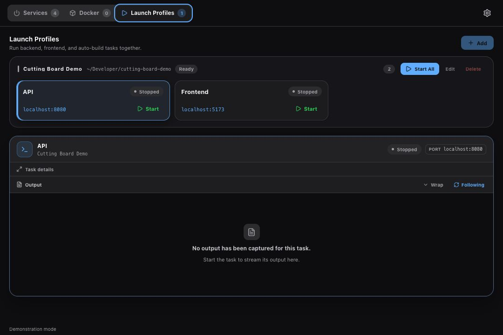

<p align="center">
  
</p>

<h1 align="center">Cutting Board</h1>

<p align="center">A native desktop control board for local development services.</p>

<p align="center">
  Discover what is running, see it by project, and start or stop your own development tasks from one place.
</p>

<p align="center">
  
</p>

## Overview

Cutting Board is a local-first desktop app for keeping track of development services on your machine. It discovers TCP listeners owned by the current user, groups them by project, identifies common runtimes and frameworks, shows Docker containers, and provides saved launch profiles for project commands.

The app is built with [Tauri 2](https://v2.tauri.app/), a TypeScript/Vite frontend, and a Rust native core. It has no account, cloud sync, telemetry, or login-startup behavior.

## Highlights

### Services

- Refreshes local TCP listeners on a configurable interval.
- Groups services by project and infers project roots from common markers such as `.git`, `package.json`, `Cargo.toml`, `pyproject.toml`, `go.mod`, Maven/Gradle files, and Compose files.
- Identifies common web frameworks, API runtimes, databases, caches, and proxies.
- Shows ports, status, uptime, memory, process origin, browser links, and process details.
- Keeps operating-system noise, desktop apps, build daemons, and unrelated-user processes out of the workspace view where they can be safely identified.

### Docker

- Reads `docker ps -a` when the Docker CLI is available.
- Shows container state, image, status, published ports, and Compose project/service metadata. Recognized published TCP web ports open in a browser: for example, Mailpit's `8025` opens `http://localhost:8025/`, an nginx mapping of host `18080` to container `80` or `18080` opens `http://localhost:18080/`, and Solr's `8983` opens `http://localhost:8983/`. Recognized target ports `443`, `8443`, and `9443` use HTTPS. SMTP port `1025`, other non-web mappings, UDP mappings, and stopped containers remain non-clickable. Links require backend published-port mapping data, so an already-running older app needs a restart after updating to a build with this support.
- Falls back to read-only container listener information when Docker cannot be queried.

### Launch Profiles

- Save a project root and multiple named shell tasks—for example, backend, frontend, and watch commands.
- Start and stop tasks individually or together, with an optional expected port for each task.
- Track the process session Cutting Board started, inspect live output, and keep task logs locally.
- Checks a task's expected port before starting. A process is stopped or restarted only when it matches a registered task and passes the existing process-identity checks.
- Shows the output of a process started elsewhere when it writes to a file: redirected stdout/stderr or an open log file, such as a Spring Boot app with `logging.file.name`.
- Expose registered launch tasks to local automation through the `cutting-board control` CLI, using the same task manager as the UI.

<p align="center">
  
</p>

## Safety and privacy

Cutting Board only exposes listeners classified as belonging to the current user. Before stopping a discovered service, the native core revalidates its PID, process creation time, and available ownership metadata, and refuses to target PID 1 or Cutting Board itself. It sends `SIGTERM` first and uses `SIGKILL` only after the validated process does not exit gracefully.

Process command lines can contain secrets. The scanner redacts common password, token, secret, authorization, credential, API-key, and URL-userinfo values before returning process details to the UI. Launch commands are intentionally user-authored shell commands, so review a profile before starting it; its logs remain local and may contain output from the launched program.

Demonstration mode disables actions that change processes or profiles.

## Prerequisites

- macOS or Linux for local service discovery (`lsof` is used first; Linux can fall back to `ss`).
- Node.js 20.19 or newer. Node.js 22.12 or newer is recommended.
- Rust 1.77.2 or newer with the stable toolchain.
- The platform dependencies listed in the [Tauri 2 prerequisites](https://v2.tauri.app/start/prerequisites/). Linux builds need WebKitGTK 4.1 development packages and the related system libraries.
- Docker CLI is optional and is only needed for full Docker metadata; the Docker tab remains available in read-only fallback mode without it.

## Quick start

```bash
npm install
npm run tauri dev
```

The Vite development server uses `http://localhost:1420` when running the frontend directly. `npm run tauri dev` starts the native desktop app and rebuilds generated runtime icons as needed.

On macOS, `npm run tauri build` selects one installed Developer ID or Apple Development signing identity for the app bundle. This keeps macOS privacy permissions attached across self-updates. If more than one matching identity is installed, set `APPLE_SIGNING_IDENTITY` to the exact identity name before building.

## Demonstration mode

Use deterministic sample services, containers, and a launch profile without changing real processes:

```bash
npm run tauri dev -- -- --demo
```

The packaged binary accepts the same native options:

```text
cutting-board --demo
cutting-board --auto-close-seconds 5
cutting-board --help
cutting-board --version
```

## External control CLI

The `cutting-board control` commands let a local script or LLM inspect and operate saved launch tasks through the already-running Cutting Board app. The app must be running as the same user and include the control endpoint. Restart Cutting Board after updating to a build that adds this feature to activate the endpoint. The endpoint uses a private per-user Unix-domain socket and does not listen on TCP.

Control addresses only registered profile tasks by profile ID and task name. A profile ID remains stable when its display name changes; a task is addressed by its current name, so use the values returned by `list` again after renaming a task. These commands do not accept arbitrary commands or PIDs, and summaries do not include saved commands, working directories, or environment variables.

From the repository root, after building the debug app, list profiles and their task state, then restart one task and inspect its latest status and bounded log tail:

```bash
./src-tauri/target/debug/cutting-board control list
./src-tauri/target/debug/cutting-board control restart --profile "<PROFILE_ID>" --task "<TASK_NAME>" --timeout-seconds 30
./src-tauri/target/debug/cutting-board control status --profile "<PROFILE_ID>" --task "<TASK_NAME>"
./src-tauri/target/debug/cutting-board control logs --profile "<PROFILE_ID>" --task "<TASK_NAME>" --lines 100
```

All commands print one JSON response to stdout. Every response has `ok`, `accepted`, and `completed`; a successful response may include `result`, and an error response includes `error.code` and `error.message`. A request that is still in progress uses an envelope like this:

```json
{
  "ok": true,
  "accepted": true,
  "completed": false,
  "operation_id": "<OPERATION_ID>"
}
```

`list.result` has the shape `{ "profiles": [{ "id", "name", "tasks": [...] }], "scanned_at", "snapshot_stale", "refresh_error" }`. Task summaries include `profile_id`, `task_name`, `name`, optional `container` and `expected_port`, `state`, process IDs when available, `started_at`, `exit_code`, `message`, `in_flight`, and `last_operation` with its ID, action, state, timestamps, and safe error details. `status.result` contains `profile: {id, name}`, one `task` summary, and the same scan freshness fields. `snapshot_stale` is true if a listener scan failed or was partial, or a task snapshot was skipped because an operation is using the manager; `refresh_error` gives a safe reason when available. Cached state is returned when available, otherwise `state` is `unknown`. This does not mean the task is stopped. Managed command task states include `starting`, `running`, `stopping`, `restarting`, `stopped`, or `failed`; container tasks report Docker state. Operation states are `running`, `succeeded`, or `failed`. Timestamps, including `scanned_at`, are Unix epoch seconds, or `null` if no successful scan has completed. `operation.result` contains an `operation` summary and its `task` summary when available. `logs.result` contains `profile_id`, `task_name`, returned `logs`, actual line and byte counts, and `truncated`. Task and operation summaries never include saved commands, working directories, environment values, log paths, or raw log text; log text is returned only by an explicit bounded `logs` request.

`accepted` means the app accepted the request; `completed` reports whether the operation has finished. If a start, stop, or restart exceeds the requested wait, the operation continues in the app. `operation` returns one snapshot; repeat it while the state is still in progress, then query the task for its current state:

```bash
./src-tauri/target/debug/cutting-board control operation "<OPERATION_ID>"
./src-tauri/target/debug/cutting-board control status --profile "<PROFILE_ID>" --task "<TASK_NAME>"
```

The action wait defaults to 30 seconds and can be set up to 300 seconds with `--timeout-seconds`. This is only the caller's wait limit; it does not cancel the saved build command or Docker action. An in-progress operation can keep that task's operation slot busy until the underlying command finishes. The wait limit does not bound the total execution time of saved subprocesses. After an accepted action, a timed-out wait returns exit code `5` with the operation ID; polling does not cancel the operation. A connection/request deadline that expires before any request bytes may be sent also returns `timeout` with exit code `5`, and the action was not submitted. If request bytes may have been sent but no acknowledgement arrives, the CLI returns `acknowledgement_unknown` with exit code `7`: the app may have accepted the action. Do not automatically retry in that case. Check `status` and `last_operation` before deciding whether to send another action. A second start, stop, or restart for the same task is rejected as `busy` while its previous lifecycle operation is still in flight; poll that operation instead. Exit code `0` means the command completed successfully, `2` an invalid request, `3` a busy operation, `4` an unknown profile, task, or operation, `5` a caller wait timeout, `6` an action failure, and `7` that the app or its socket is unavailable or the acknowledgement is unknown. The corresponding stable error codes include `invalid_request`, `busy`, `unknown_profile`, `unknown_task`, `unknown_operation`, `unavailable`, and `acknowledgement_unknown`; action failures may include a more specific manager error code.

A completed start means Cutting Board's manager spawned the task and still sees its process running. It does not mean the task's port is listening or that an HTTP health check passed. If a process already runs outside Cutting Board and matches the registered task's port and working directory, `start` reports that current task instead of starting a duplicate; use `restart` to replace it through the registered task. External processes are acted on only after the existing task-matching and process-identity checks succeed; control cannot target arbitrary discovered services or PIDs. A completed result and status include the current state and most recent managed exit code when available. The app retains up to 64 completed operation records in memory; records do not survive an app restart and older records can be pruned as new operations finish.

For a managed command task, stop sends `SIGTERM` to that task's own process group, waits up to 2 seconds, then sends `SIGKILL` if needed and verifies the group exits for up to 1 second. For a strictly matched external task, Cutting Board revalidates the process identity and signals only that same-user PID and verified same-user descendants; it does not guess at or stop shared parent processes. Before replacing an external task, it checks its configured expected TCP port for up to 3 seconds and fails closed if it cannot verify release. Restart preparation runs before stopping the current process, so a failed build leaves the old process running.

`logs` reads a bounded tail (200 lines by default, at most 1,000 lines and 65,536 bytes). For a container task, it starts with Docker's latest 200 timestamped lines and applies the requested bounds. Use `--lines` and the optional `--max-bytes` to request a smaller tail. Application output may contain credentials or other secrets, so request only the lines needed and handle the returned text accordingly.

## Development commands

| Command | Purpose |
| --- | --- |
| `npm run check` | Type-check the frontend. |
| `npm run build` | Type-check and build the Vite frontend. |
| `npm run icons` | Regenerate runtime and application icons. |
| `cargo fmt --manifest-path src-tauri/Cargo.toml --all -- --check` | Check Rust formatting. |
| `cargo test --manifest-path src-tauri/Cargo.toml --all-targets` | Run the Rust test suite. |
| `npm run tauri build` | Build the Tauri application bundle. |

Equivalent Make targets are available for the common workflow:

```bash
make install
make dev
make check
make test
make build
```

Rust tests are embedded in `#[cfg(test)]` modules under `src-tauri/src/`; there is no separate tracked test directory.

## Local data

Cutting Board resolves its application data directory through Tauri's `app_config_dir`. It stores:

- `settings.json` — theme, scan interval, and saved window geometry.
- `launch-profiles.json` — local launch profiles and their tasks.
- `logs/` — output captured from managed launch tasks.

These files stay on the device and are not synchronized to a service.

## Repository layout

```text
assets/                         Icon source and current interface screenshots
public/icons/                   Generated UI and technology icon assets
scripts/build-icons.mjs         Rebuilds generated icon assets
src/                            TypeScript frontend and Tauri API client
src-tauri/src/                  Rust scanner, Docker integration, storage, and launch manager
src-tauri/capabilities/         Tauri capability declarations
package.json                    Frontend scripts and dependencies
Makefile                        Common development commands
```

## License

MIT. See [LICENSE](LICENSE).
